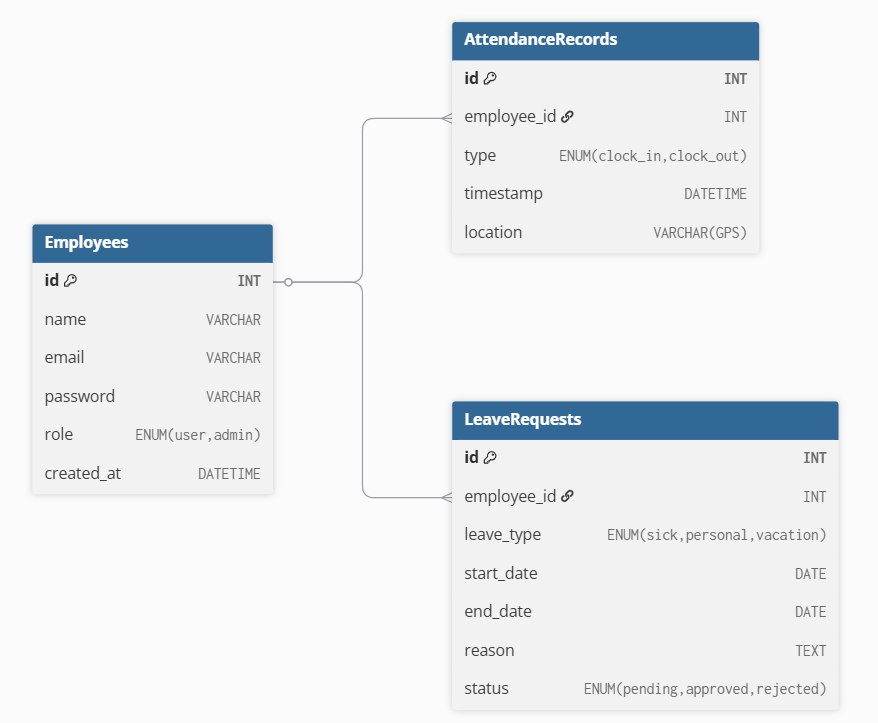

# ✅ 專案目標：數位化員工打卡管理系統

## 🌟 轉型重點：

紙本 ➜ Web 打卡 Web

管理人工計算 ➜ 系統自動統計出勤

提升管理透明度 ➜ 圖表、日報月報

# 🧩 功能規劃

## 員工端（Web）：

| 功能            | 說明                           |
| --------------- | ------------------------------ |
| 📥 登入 / 註冊  | 使用帳號密碼登入，或用員工編號 |
| 🕒 上下班打卡   | 傳送時間戳 + GPS               |
| 📅 查看出勤紀錄 | 日、週、月                     |
| 📤 請假申請     | 請假紀錄、類型選擇             |

## 管理者端：

| 功能        | 說明                                   |
| ----------- | -------------------------------------- |
| 📊 出勤報表 | 每日、每月統計，異常提醒（遲到、漏打） |
| 👤 員工管理 | 新增 / 停用 / 編輯員工                 |
| 🧾 匯出報表 | Excel / PDF                            |
| 🛰️ 出勤定位 | 顯示打卡時位置（可選）                 |

# 🏗️ 技術架構建議

| 元件     | 技術                                                       |
| -------- | ---------------------------------------------------------- |
| 後端     | Spring Boot (Spring Web, Spring Security, Spring Data JPA) |
| 資料庫   | MySQL / PostgreSQL                                         |
| 驗證     | JWT                                                        |
| 前端     | React                                                      |
| 匯出報表 | Apache POI (Excel), JasperReports (PDF)                    |
| 定位     | HTML5 Geolocation API + Google Maps API (optional)         |

# 🧱 資料表設計（簡化版）

https://dbdiagram.io/d/打卡數位轉型-6888451acca18e685c295815


```
Table Employees {
  id INT [pk]
  name VARCHAR
  email VARCHAR
  password VARCHAR
  role ENUM('user', 'admin')
  created_at DATETIME
}
```

```
Table AttendanceRecords {
  id INT [pk]
  employee_id INT [ref: > Employees.id]
  type ENUM('clock_in', 'clock_out')
  timestamp DATETIME
  location VARCHAR (GPS)
}
```

```
Table LeaveRequests {
  id INT [pk]
  employee_id INT [ref: > Employees.id]
  leave_type ENUM('sick', 'personal', 'vacation')
  start_date DATE
  end_date DATE
  reason TEXT
  status ENUM('pending', 'approved', 'rejected')
}
```

# 📁 專案結構

```
Attendnece_system/
 ├─── backend/
 │    └──src/
 │       └── main/
 │           ├─── java/com/Shen/attendance/
 │           │   ├── controller/
 │           │   ├── service/
 │           │   ├── model/
 │           │   ├── Dao/
 │           │   └── AttendanceApplication.java
 │           └── resources/
 └───frontend/
     ├──public/
     ├──src/
     │  ├── assets/
     │  └── components/
     └── index.html
```

## 🛠️ 如何啟動

```bash
# 1. 複製專案
git clone https://github.com/Shen880421/attendance-system.git
cd attendance-system

# 2. 建立資料庫
create database attendance_system;

# 3. 修改 application.yml 中的 DB 設定

# 4. 啟動應用
./mvnw spring-boot:run
```

# 🖼️ 使用者畫面示意

## 📱 員工端：

「上班打卡」按鈕

打卡時間顯示

顯示今日出勤狀態（含 GPS）

## 🖥️ 管理者後台：

表格列出所有員工出勤狀況

異常紅字標示（遲到、未打卡）

篩選時間區間、匯出按鈕

# 📌 API 文件

請見 docs/api-spec.md 或 Swagger UI（啟動後：http://localhost:8080/swagger-ui.html）
Postman 測試檔 AttendanceSystem.postman_collection.json

# 📄 API 設計文件（`docs/api-spec.md`）

## 📄 Attendance System API 文件

Base URL: `http://localhost:8080/api`

## 🔐 Auth

### POST `/auth/login`

#### 登入系統

```json
Request:
{
  "email": "user@example.com",
  "password": "123456"
}

Response:
{
  "token": "JWT_TOKEN"
}
```

#### 👤 員工 API

GET /employees/me
取得個人資訊（需 JWT）

POST /attendance/clock
員工打卡（上班或下班）

```json
Request:
{
  "type": "clock_in", // or "clock_out"
  "location": "25.0478,121.5319"
}
```

GET /attendance/history
取得自己的打卡紀錄

```
GET /attendance/history?start=2024-01-01&end=2024-01-31
```

POST /leave/request
送出請假申請

```
{
  "leaveType": "sick",
  "startDate": "2025-07-01",
  "endDate": "2025-07-02",
  "reason": "感冒發燒"
}
```

#### 🛠️ 管理者 API

GET /admin/employees
列出所有員工

POST /admin/employees
新增員工

```
{
  "name": "陳明賢",
  "email": "ming@example.com",
  "password": "abc123"
}
```

GET /admin/attendance/report
產出出勤報表

```
GET /admin/attendance/report?month=2025-07
```

PUT /admin/leave/{id}/approve
審核請假申請

```
{
  "status": "approved"
}
```

🔒 所有需要身份驗證的 API 須在 Header 加上：

Authorization: Bearer <JWT_TOKEN>

# 🚀 開發順序建議

✅ Spring Boot 基礎架設 + MySQL

✅ 員工註冊 / 登入（JWT）

✅ 打卡功能 + 資料表記錄

✅ 出勤紀錄列表查詢（員工端）

✅ 管理者後台與報表

✅ 地理位置（可選）

✅ 匯出功能

# 📦 延伸功能（可選）

打卡通知（Email / LINE Notify）

智能異常判斷（遲到、早退、忘打卡）

與 HR 系統對接

行動 App + QR Code / NFC 打卡
